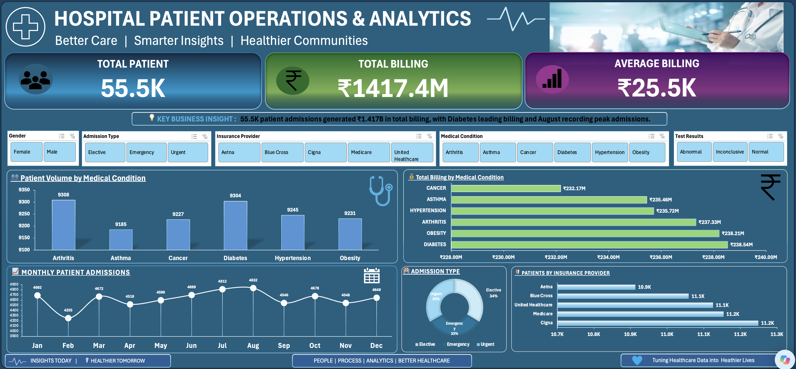

# Hospital Patient Operations & Analytics Dashboard

## Project Overview
> **Note:** This project uses a practice dataset provided by my mentor for learning and portfolio development.
This project focuses on analyzing hospital patient operations and billing data using Microsoft Excel.

The dashboard provides an interactive view of patient admissions, billing performance, medical conditions, admission types, and insurance provider distribution.

The objective is to transform raw operational data into meaningful business insights that support data-driven decision-making.

## Business Objective

The primary objective of this analysis is to understand:

- Patient admission trends
- Billing performance
- Medical condition distribution
- Admission type distribution
- Insurance provider patient distribution
- Monthly patient admission patterns

## Tools & Technologies

- Microsoft Excel (Advanced)
- PivotTables
- PivotCharts
- Slicers
- Data Cleaning
- Data Analysis
- Data Visualization
- Dashboard Development
  
## Key Performance Indicators

| KPI | Value |
|---|---:|
| Total Patients | 55.5K |
| Total Billing | ₹1.417B |
| Average Billing | ₹25.5K |

## Dashboard Analysis

The dashboard provides analysis across the following business dimensions:

- Patient Volume by Medical Condition
- Total Billing by Medical Condition
- Monthly Patient Admissions
- Admission Type Distribution
- Patients by Insurance Provider

## Key Business Insights

- Arthritis records the highest patient volume among the medical conditions analyzed.
- Diabetes generates the highest total billing among the medical conditions analyzed.
- August records the highest monthly patient admissions.
- Total billing varies across medical conditions.
- Insurance providers show different levels of patient distribution.

## Dashboard Preview

## Project Outcome

The project demonstrates how Microsoft Excel can be used to clean, analyze, visualize, and communicate operational data through an interactive dashboard.

The dashboard transforms raw data into structured KPIs and meaningful business insights.

## Skills Demonstrated

- Data Cleaning
- Data Analysis
- Data Visualization
- Excel Reporting
- Pivot Table Analysis
- Dashboard Development
- Business Insight Generation
- Data-Driven Decision Making
## Analytical Approach

The analysis follows a structured data analytics workflow:

1. Data preparation and cleaning
2. Exploratory data analysis
3. KPI development
4. Pivot Table and Pivot Chart analysis
5. Interactive dashboard development
6. Business insight generation
